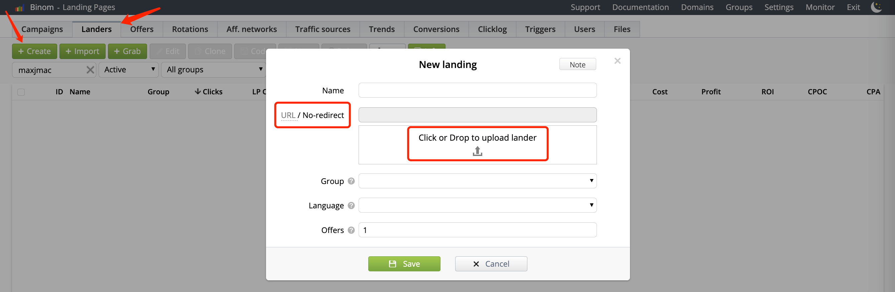
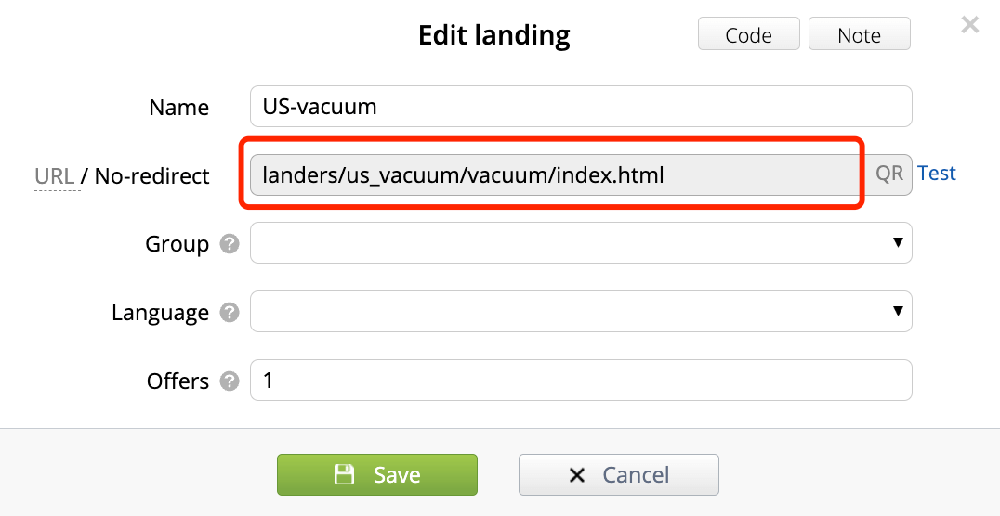
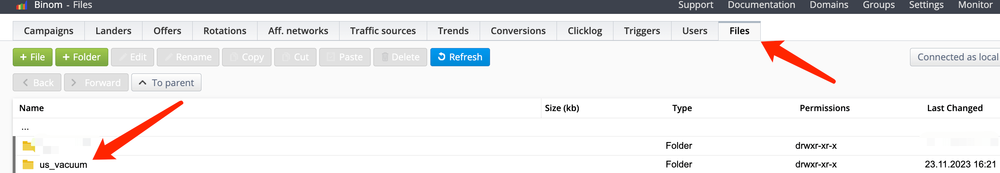
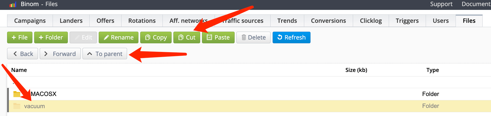
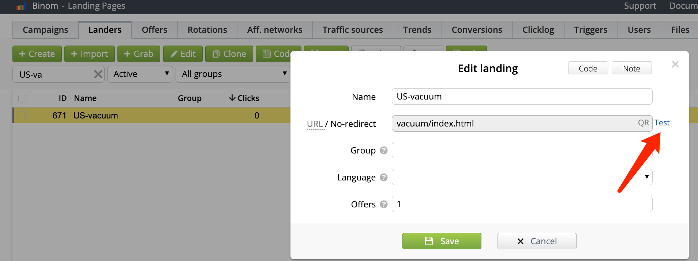
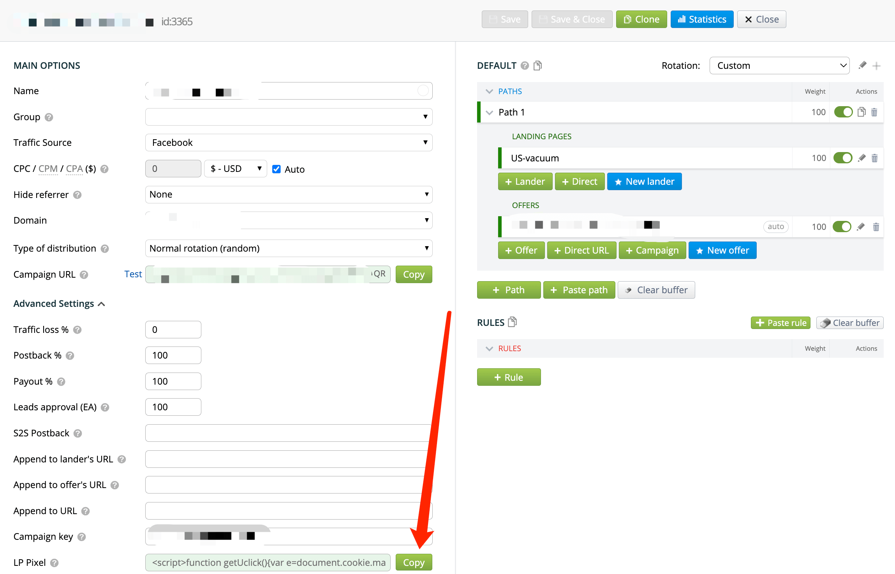
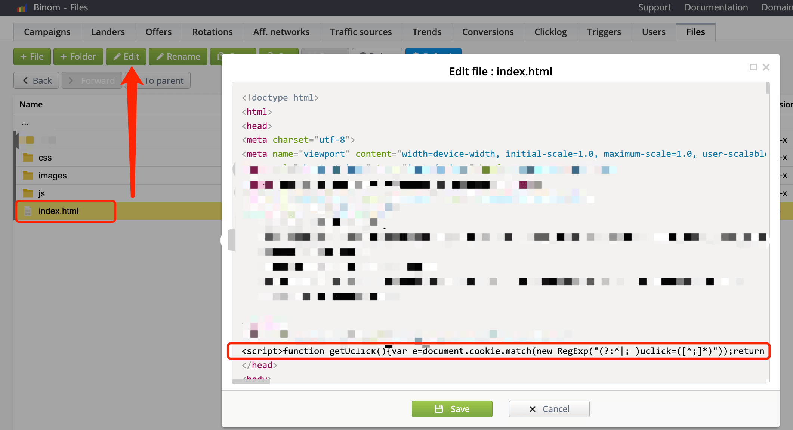
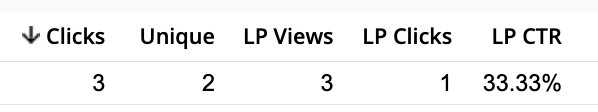

Recently, while learning about Facebook ad placement, the first challenge I encountered was that Facebook does not support redirects. This means I cannot use a campaign URL for promoting like I do with push ads, as using a campaign URL would involve a redirect to the landing page.

Some friends suggested I use other trackers, but other trackers are either expensive or slow, none meeting all my requirements like Binom, which is both affordable and effective.

So, by reviewing Binom's official documentation and combining it with my practical experiences through multiple trials and experiments, I managed to meet the need for no redirect while still being able to effectively gather data.

This solution not only satisfies Facebook's review but also helps when you are placing other types of ads (Push/Pop/Banner/Native), avoiding point loss due to redirects, thereby improving LP CTR and overall performance.

**Ad**: By registering for Binom through my link, you can enjoy the first month for free and a 60% discount for the second month, which is the lowest rate available. With other sources or alliances, you can only get at least a 40% discount for the second month. Link: [https://binom.org/signup?from=MAXJMAC60](https://binom.org/signup?from=MAXJMAC60) or use the discount code: **MAXJMAC60**.

### Steps:

#### 1.Uploading Lander:

Clean up your Landing Page as usual, compress images, and zip the folder.
Go to the Tracker backend, switch to the Landers tab, and click the **+ Create** button.
Enter the LP name, click **No-redirect** in the URL/No-redirect column, and upload your zip file.
After successful upload, click the green **Save** button.

The default path for files starts with **landers/**. The complete access address is any domain of your tracker followed by the path. For example, if my tracker's domain is maxjmac.com, the full access path would be `https://maxjmac.com/landers/us_vacuum/vacuum/index.html`. The first 'us_vacuum' after 'landers' is based on the Landing's name; if you don't enter a name when uploading, a random string of characters will be assigned, and the second 'vacuum' is the name of my compressed file's folder.

If you don't like the domain name followed by such a long path, you can switch to the **Files** tab, where it defaults to the **landers** path.

Double-click to enter the 'us_vacuum' folder, select your folder, and then click the Cut button at the top to cut it.

Then click the 'To parent' button to go back to the parent directory, click the 'To parent' button again to return to the directory at the same level as the 'landers' folder, which is the root directory of the domain. Click the Paste button to paste the folder into the root directory.
Go back to the 'Landers' tab, find your Landing Page that you were working on, edit the path by deleting the preceding 'landers/us_vacuum/' and save it, as shown in the following image:

Now, your Landing Page access path will become `https://maxjmac.com/vacuum/index.html`. You can click the blue 'Test' button on the right of the above picture to test it.

#### 2.Creating a campaign:

As shown in the above picture, after setting up the campaign, click 'Advanced Settings' on the left, click the 'Copy' button next to LP Pixel, and copy the code.
Then, go to the Files tab, find the folder where your Landing Page is located, select 'index.html', click 'Edit' at the top, paste the code before the **</head>** tag, and save.

#### 3.Access Test:

Go back to the campaign you just created, copy the Campaign URL, and replace it for Facebook ad promoting as direct redirects are not allowed.
The new URL will be something like https://maxjmac.com/vacuum/index.html?ad_id={{ad.id}}&adset_id={{adset.id}}&campaign_id={{campaign.id}}&site_source_name={{site_source_name}}&placement={{placement}}.

When using this link for promoting, users directly visit the Landing Page without redirects. This is essentially moving the parameters from the campaign URL to the end of the Landing Page URL. The key parameter information from the campaign URL is already in the LP Pixel code and added to the head tag of the Landing Page. After visiting the URL and clicking the final CTA button, it will properly redirect to the offer page and correctly record LP CTR and other information.

### Summary:
If you have already tested your Landing Page, this solution might further improve your campaign performance by avoiding some traffic loss due to redirects and effectively gathering the necessary data.

Binom's documentation is very comprehensive, and their support is very nice and professional. As long as you clearly express your needs, you can generally get good solutions to your problems.