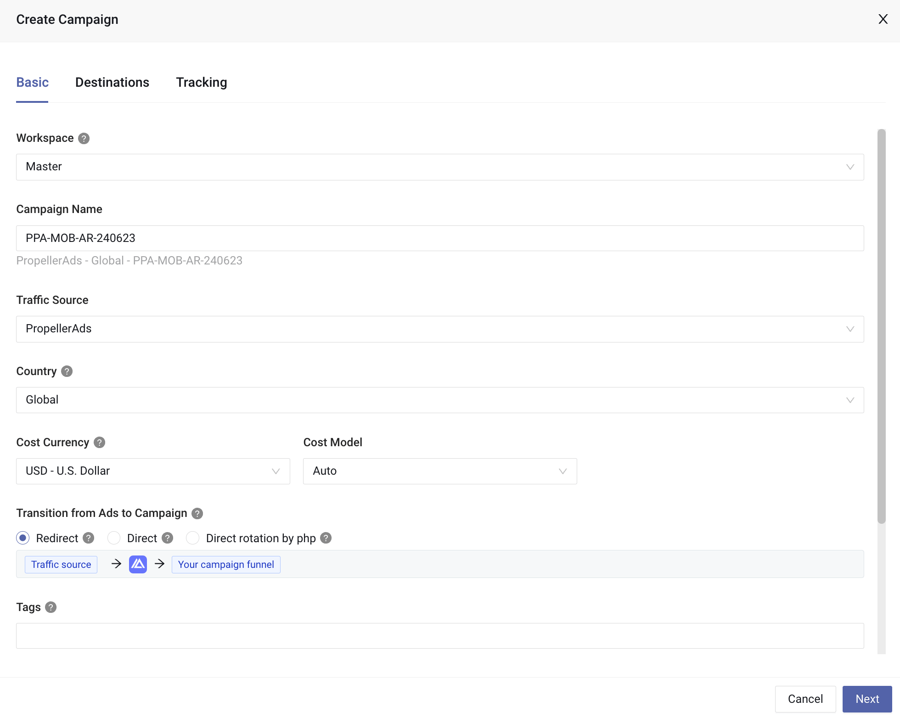

> 不知道的还以为是我搞的 -_-

从事Media buy以来，使用过一些追踪器(Tracker)，从最早学习40天时使用的Voluum，到JustATracker(已停止维护)，再到Kintura(已停止维护)，最后使用Binom，至今三年有余。

### 云追踪 vs Self-host

长期以来，我一直认为Binom就是最好的Tracker，不限制事件数，数据永久保存。现在看来并不严谨，应该说是最好的Self-host Tracker。

因为最近看到一篇[帖子](https://afflift.com/f/threads/%E2%9A%A1-ive-tested-redirect-speeds-for-6-different-trackers-here-are-my-results-%F0%9F%93%88.13113/?r=39423)比较各追踪器的重定向速度。于是我也上手去测试了一下，发现我当前方案(Binom+Cloudflare) 的速度确实是不够令人满意的，至少在跑全球流量这一块，单服务器Location的速度性能是不足的。加上Binom v1已经很长时间没有更新内容了，Binom团队倾向于v2的开发与维护，当然你也可以认为是v1已经足够稳定的原因。

云追踪和Self-host之间的优缺点也很明显，云追踪就是个SaaS，上手就是用，不需要你操心任何事情，但是限制也多，比如事件数，Custom domain，数据保存期限等，有的甚至限制Campaign数。Self-host则几乎没有限制，无限事件数，无限数据保存期限，无限Custom domain。但是你需要自己维护服务器，多一个服务器费用的支出。还有个缺点就是单服务器的话，离你campaign geo地理位置比较远的话，可能速度性能不那么理想，而多服务器的话，费用又会比较昂贵。

我对比了众多云追踪（价格/功能/性能/维护），认为MaxConv是目前云追踪里面最好的选择。

### MaxConv介绍

注册链接: [https://maxconv.com/?utm_source=kgxast&utm_medium=refprog](https://maxconv.com/?utm_source=kgxast&utm_medium=refprog)

首先价格上来说，MaxConv提供每月15万事件的免费版本，虽然限制了只能一个Custom domain，以及最多25个active campaigns，但这对于新手或者是想要尝试一下这个Tracker来说已经足够了，毕竟完全免费。付费计划里的$45/月，每月一百万事件虽然不是云追踪里面最便宜的，但是功能和性能对比下来，相较其他云追踪也是性价比很高的。

功能上来说，主流流量源的Integrations我认为是一大亮点，既支持新手比较热门的PropellerAds，又支持Google/Facebook/TikTok等大型流量源，说明开发团队还是比较用心的。

性能上来说，覆盖全球的AWS服务器节点可以让你跑任何一个geo的重定向速度都是极好的。

维护力度上来说，开发团队非常听劝，只要是合理的功能诉求，响应速度很快。更新的频率也是比较高的。

### MaxConv界面

界面非常简洁，加载速度也很快，如图是仪表盘部分，下文会进行实操逐一介绍各功能，这里就不多做介绍。

### 实操

我将以[Golden Goose](https://gg.agency/register?ref=VDsycZVduMR8u-vD)联盟，[PropellerAds](https://partners.propellerads.com/#/app/auth/signUp?ref_id=e2e1476509ed)流量源为例，介绍联盟配置，流量源配置，Offer配置，Lander配置，Flow配置，Integration配置，Campaign配置这些基础用法。

#### 1.联盟配置

点击上图中1处切换到Affiliate Networks即联盟界面，点击2处创建新联盟，在弹出窗口中输入`Golden Goose`即可找到相应模板，如下图：

选择模板后在打开的窗口中复制右下角的postback链接，然后点击右下角的Save按钮即可，如下图：

打开Golden Goose的后台，点击右上角邮箱，点击Account，将postback链接粘贴到PostBack URL处，如下图：

图中文本的选中部分可有可无，删去亦可，留着也无妨。点击下方Update保存即可。

#### 2.流量源配置

点击上图中1处切换到Traffic Sources即流量源页面，点击2处创建新流量源，在弹出窗口中选择PropellerAds，如下图：

打开PropellerAds后台，点击左侧菜单的Tracking，在打开的页面中选择右下角的Other tracker or CPA Network，如下图：

在打开的页面中，点击Copy this S2S Postback URL以复制流量源的postback，如下图：

回到MaxConv的PropellerAds配置页面，将链接中的`${SUBID}`替换成`{external_id}`，`${PAYOUT}`替换成`{payout}`，如下图划线处所示：

点击右下角的Save按钮保存即可。

#### 3.Offer配置

打开Golden Goose后台，选择其中一个Offer，点击`VIEW DETAILS & GET LINK`按钮，在打开的页面中，点击Offer详情页右方的GET LINK按钮，如下图：

在打开的页面中，点击下图中红框部分复制offer链接，最后点击右下角的Finish按钮即可。

回到MaxConv后台，点击1处切换到Offers页面，点击2处Create按钮，如下图：

在弹出的窗口中，Name处填入`联盟名称-offerid-GEO[-运营商]`（命名习惯只是建议，请随意，下同），下方Affiliate Network选择Golden Goose，将联盟处复制的offer链接粘贴到URL处，将`{mc_click_id}`拼接到`p1=`后，其余部分可以删去，最后点击右下角的Save按钮保存即可，如下图：

#### 4.Lander配置

点击上图1处切换到Landers即落地页页面，点击2处Create按钮。

在弹出的窗口中，Name处输入`GEO-Lander`的格式，将右侧的Click URL复制，粘贴到Lander最终的跳转按钮处，最后将Lander的访问链接填入URL处，点击右下角Save保存即可，如下图：

#### 5.Flow配置

Flow并不是必要配置，只有当你多个campaign共用一个Funnel的时候方便同时修改用，此处只是演示如何配置Flow。

点击上图1处切换到Flows页面，点击2处创建Flow。

在弹出的窗口中的Flow Name处输入`GEO-Flow名称`，然后点击上方的Destinations切换到Flow配置页面。

如上图配置好Landers和Offers后，点击右下角的Save按钮保存即可。

#### 6.Integration配置

Integration也不是必要的配置，但是可以通过API更好的同步流量源的实际Cost，也可以在Tracker控制流量源campaign的启停。

点击上图中1处切换到Integration页面，点击上图2处的+ Add Itegration按钮。在弹出的窗口中选择PropellerAds，如下图：

打开PropellerAds后台，点击右上角，进入Account settings，切换到API Access，点击Create token按钮，给个命名例如MaxConv。创建成功后复制Token。

回到MaxConv，给个命名，API Token处粘贴Token，保持下方Sync Cost开启即可以自动纠正Cost，点击下方Save保存即可，如下图：

创建成功后，可以点击下图中按钮，将流量源的campaign与Tracker中的campaign进行匹配，匹配后即可在Tracker中控制启停，如下图：

#### 7.Campaign配置

点击上图1处切换到Campaigns页面，点击2处创建新campaign。

在弹出的窗口中，Campaign Name处填入`流量源简称-设备[-出价模式]-GEO-日期`，下方Traffic Source选择PropellerAds，如下图：

随后点击右下角Next进入Destinations设置，可以直接在Paths中配置，也可以使用上面配置好的Flow，如下图：

配置好后点击右下角的Save按钮，会自动跳到第三个Tab Tracking处。

这里的Campaign URL就是我们要放到流量源进行投放的URL，最后点击右下角的Save保存即可，如下图：

### MaxConv优缺点

优点：

- 速度快，不论是界面响应速度还是重定向速度；
- 使用方便，不需要像Self-host那样自己安装维护；
- 集成多，各大流量源的Integration很好地提升了使用体验；
- 性价比高，对比其他云追踪，也对比Self-host，整体来说性价比是非常高的。
- 更新快，开发团队在开发维护方面做得非常好，新功能开发快。
- 有中文支持，官方客服QQ 2948298318

缺点：

偶尔会后台崩溃进不去。问过几次客服，说是因为用户越来越多，负载太大，在扩容导致，他们也在优化自动扩容策略。说是不影响流量和postback，据我观察流量源收到的postback，确实没有影响。

### 总结

整体来说我是非常推荐这个云追踪的，新手友好，跑FB之类的也非常好用，有缺点但瑕不掩瑜。现在已经作为我的第二主力追踪在使用中了，希望他们越来越稳定，我也逐渐把一些更需要全球流量的campaign搬过来，说不定表现会有提升。

以上。

